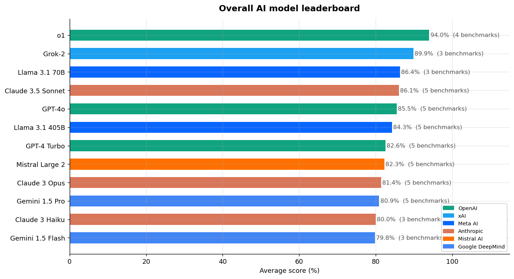

# 🤖 AI Model Performance Tracker

A full end-to-end data analysis project that tracks, compares, and visualises the performance of 15 leading AI models across industry-standard benchmarks — built with Python and PostgreSQL.



---

## 📌 What This Project Does

This project answers a real question: **which AI model gives you the best performance for your money?**

Using publicly available benchmark data, it stores model scores in a PostgreSQL database, runs SQL analysis queries, and generates visualisations that reveal cost vs performance tradeoffs across models from OpenAI, Anthropic, Google, Meta, Mistral, and xAI.

---

## 📊 Key Findings

- **Best value:** Claude 3.5 Sonnet scores 86.1% at $3/1M tokens — the same performance as Claude 3 Opus which costs $15/1M tokens (80% cheaper)
- **Open source is competitive:** Meta's Llama 3.1 70B (free, open weights) outscores GPT-4o despite being free to use
- **Specialisation matters:** OpenAI's o1 dominates the MATH benchmark at 94.8%, confirming its strength in complex reasoning
- **The cost cliff:** Pushing above 90% average score requires a 5× cost increase for only 5–8% gain

---

## 🛠️ Tech Stack

| Tool | Purpose |
|------|---------|
| PostgreSQL 16 | Relational database for storing model and benchmark data |
| Python 3 | ETL pipeline, analysis, and chart generation |
| pandas | Data cleaning and transformation |
| psycopg2 | Python-to-PostgreSQL connection |
| matplotlib | Chart generation |
| seaborn | Heatmap visualisation |
| SQL window functions | RANK(), LAG() for leaderboards and trend analysis |
| Git + GitHub | Version control and portfolio publishing |

---

## 📁 Project Structure

```
ai_tracker/
└── files/
    ├── 01_schema.sql           # Database tables, indexes, and v_scores view
    ├── 02_seed_data.sql        # 15 real AI models and benchmark scores
    ├── 03_analysis_queries.sql # 10 analytical SQL queries with comments
    ├── etl_pipeline.py         # Extract → Clean → Load pipeline
    ├── analysis.py             # Runs queries and generates 4 charts
    └── charts/
        ├── 01_overall_leaderboard.png
        ├── 02_benchmark_heatmap.png
        ├── 03_cost_vs_performance.png
        └── 04_open_vs_closed.png
```

---

## 🗄️ Database Schema

4 normalised tables connected by foreign keys:

```
providers ──< models ──< benchmark_scores >── benchmarks
```

- **providers** — OpenAI, Anthropic, Meta AI, etc.
- **benchmarks** — MMLU, HumanEval, GSM8K, MATH, TruthfulQA
- **models** — name, cost, release date, parameters, modality
- **benchmark_scores** — the fact table linking models to benchmark results
- **v_scores** — a view that joins all 4 tables for easy querying

---

## 📈 Charts

### Overall Leaderboard
Ranks all models by average score across benchmarks, colour-coded by provider.

### Benchmark Heatmap
Shows every model's score on every benchmark in a colour-coded grid.

### Cost vs Performance
Scatter plot revealing which models offer the best value — high score at low cost.

### Open vs Proprietary
Compares free open-weight models against paid proprietary models by benchmark.

---

## ⚙️ SQL Highlights

Key SQL concepts used in this project:

```sql
-- Leaderboard using RANK() window function
SELECT
    benchmark,
    model_name,
    score,
    RANK() OVER (PARTITION BY benchmark ORDER BY score DESC) AS rank
FROM v_scores
ORDER BY benchmark, rank;

-- Score improvement over time using LAG()
SELECT
    benchmark,
    model_name,
    score,
    LAG(score) OVER (PARTITION BY benchmark ORDER BY release_date) AS prev_score,
    ROUND(score - LAG(score) OVER (PARTITION BY benchmark ORDER BY release_date), 1) AS gain
FROM v_scores;
```

---

## 🚀 How to Run

### Prerequisites
- PostgreSQL 16+
- Python 3.10+
- VS Code with SQLTools extension (optional but recommended)

### 1. Clone the repository
```bash
git clone https://github.com/YOUR_USERNAME/ai-model-tracker.git
cd ai-model-tracker
```

### 2. Install Python libraries
```bash
pip3 install psycopg2-binary pandas requests matplotlib seaborn python-dotenv adjustText
```

### 3. Create the database
```bash
psql -U your_postgres_username -c "CREATE DATABASE ai_tracker;"
```

### 4. Configure your connection
Create a file called `.env` in the `files/` folder and fill in your own details:

```
DB_HOST=localhost
DB_PORT=5432
DB_NAME=ai_tracker
DB_USER=your_postgres_username
DB_PASSWORD=your_password_if_set
```

> ⚠️ Never commit this file. It is already listed in `.gitignore`.

### 5. Run the schema and seed data
Open `01_schema.sql` in VS Code → select all → Run Selected Query.
Then repeat with `02_seed_data.sql`.

Or via terminal:
```bash
psql -U your_postgres_username -d ai_tracker -f files/01_schema.sql
psql -U your_postgres_username -d ai_tracker -f files/02_seed_data.sql
```

### 6. Generate charts
```bash
cd files
python3 analysis.py
```

Charts will be saved to `files/charts/`.

---

## 🔒 Security

- `.env` is listed in `.gitignore` and is never committed
- No credentials are hardcoded anywhere in the codebase
- All database connections use environment variables

---

## 📚 Data Sources

| Source | URL |
|--------|-----|
| Hugging Face Open LLM Leaderboard | https://huggingface.co/spaces/open-llm-leaderboard |
| Papers With Code | https://paperswithcode.com/sota |
| Artificial Analysis | https://artificialanalysis.ai |

---

## 🧠 Skills Demonstrated

`PostgreSQL` `Database Design` `SQL Window Functions` `ETL Pipeline` `Python` `pandas` `matplotlib` `seaborn` `Data Cleaning` `Data Visualisation` `Git` `GitHub`

---

*Built as a portfolio data analysis project — June 2026*
